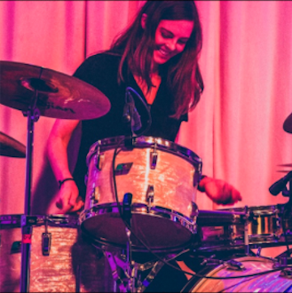

<div class="row" style="padding-top: 60px;">
<div class="row" style="padding-left: 40px;">

<div class="row">
<div class="col-sm-5">

|About|  |
|:--------|-------:|


Hi! I'm Kat. I'm a PhD student studying Quantitative Methods at the University of Pennsylvania, and an incoming summer associate in Analytics at <a href = "https://www.gbkcollective.com/team" target = "_blank"> GBK Collective</a>. When I'm not analyzing data, I'm probably writing about music, or better yet, <a href = "https://www.youtube.com/watch?v=8ptHIdVHFNs" target = "_blank"> making it</a>.

This site is a working portfolio. Check out some sample projects at the tabs above, and see GitHub for code.


|Contact |  |
|:--------|-------:|

kjanewil at upenn.edu


  <a href="https://github.com/katjanewilson" target = "_blank"><i class="fa fa-github"    aria-hidden="true"></i> </a> <a href="https://www.linkedin.com/in/kat-wilson-920256139/" target = "_blank"><i class="fa fa-linkedin" aria-hidden="true"></i></a> <a href="https://towardsdatascience.com/@katjanewilson/" target = "_blank"><i class="fa fa-medium" aria-hidden="true"></i></a>
  

  
  
</section>


<a href="https://pudding.cool/" target = "_blank">
```{r, echo=F, fig.dim = c(1,1)}

```
</a>


