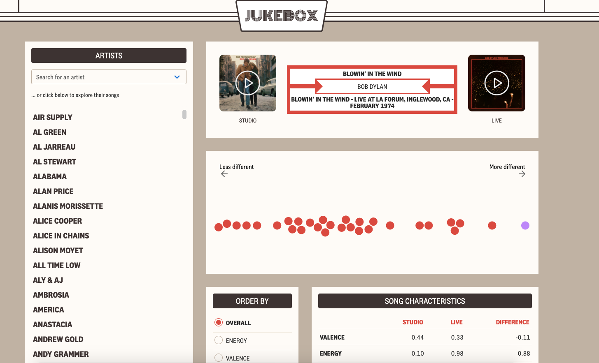
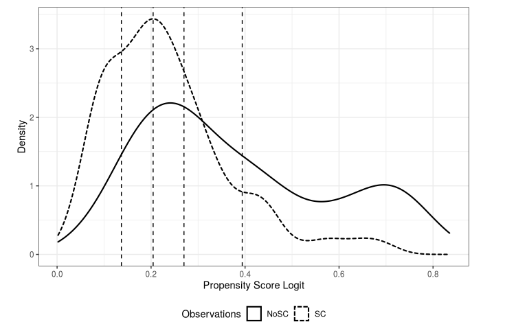
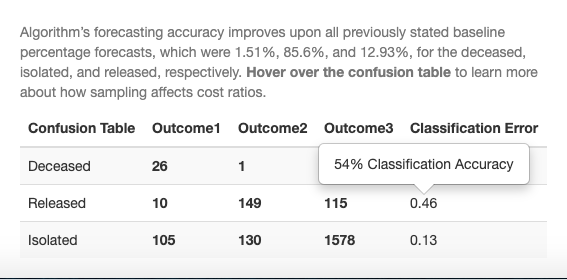

---


<p> Samples of past and current projects </p>


---

#### Small Samples Generalization


<div class="row">
<div class="col-sm-6">

|Overview|  |
|:--------|-------:|

Researchers working in a small sample framework (where the sample size is <10% of the population) have justifiable concerns about generalizability, or how findings translate to a larger target population of interest. Under a Monte Carlo simulation framework, we evaluate how covariance adjustment and matching methods affect bias in estimates of the ATE (Average Treatment Effect). The adjustment methods assessed include stratification, IPTW (Inverse Probability Treatment Weighting), and Bayesian Additive Regression Trees (used here as a non parametric approach to estimating propensity scores).

|Technical |  |
|:--------|-------:|
BART: Bayesian Additive Regression Trees, BART </br>
Matching: R (MatchIt, PSWeight)

  <a href="https://github.com/katjanewilson/BARTsimulation" target = "_blank"><i class="fa fa-github" aria-hidden="true"></i></a>

</div>
<div class="col-sm-6">

</div>
</div>

-----


#### Spotify Web API


<div class="row">
<div class="col-sm-6">

|Overview|  |
|:--------|-------:|

Data from the <a href = "https://developer.spotify.com/documentation/web-api/" target = "_blank"> Spotify API </a> are fodder for a few data journalism projects currently in the works. One project, made in conjunction with data journalists at <a href = "https://pudding.cool/" target = "_blank"> The Pudding</a>, visualizes the differences of live and studio recordings across 10,000 artists' discographies. Other work explores a single artist's data, such as <a href = "https://towardsdatascience.com/its-just-a-minor-thing-keeping-up-with-the-red-hot-chili-peppers-217ba4449746" target = "_blank"> tempo tracking </a> the Red Hot Chili Peppers, or <a href = "https://towardsdatascience.com/heaven-knows-im-miserable-now-limitations-of-sentiment-analysis-with-a-very-sentimental-band-215c6d898ba7" target = "_blank"> sentiment analysis </a> of songs by the Smiths. 
  
|Technical |  |
|:--------|-------:|
Web scraping: Python (BeautifulSoup) </br>
Data Cleaning: tidyverse </br>
Data visualization: D3.js

</div>
<div class="col-sm-6">

<a href="https://pudding.cool/" target = "_blank">
```{r, out.width=300, out.height=200, echo=F}

```
</a>

</div>
</div>
---


#### Matched Comparison of NYC Public Schools

<div class="row">
<div class="col-sm-6">

|Overview |  |
|:--------|-------:|

NYC public schools vary randomly on whether or not they have the option of a self-contained classroom for students with special needs. Matching schools on various demographic variables, I explore the effect of the self-contained class option on Attendance Rates. Employing propensity score weighting through IPTW, I create a weighted population in which the covariate distribution is balanced between treatment groups, and then later use principal stratification to explore heterogeneity in treatment effect.

|Technical |  |
|:--------|-------:|
Matching: R (MatchIt, IPTW)

  <a href="https://katjanewilson.github.io/NYC_open_data/index/" target = "_blank"><i class="fa fa-github" aria-hidden="true"></i></a>


</div>
<div class="col-sm-6">

<a href="https://katjanewilson.github.io/NYC_open_data/" target = "_blank">
```{r, out.width=300, out.height=200, echo=F}

```
</a>

</div>
</div>

---


#### COVID-19 Open Research


<div class="row">
<div class="col-sm-6">

|Overview |  |
|:--------|-------:|

Central to the debate of ethical algorithm design is a consideration of mis-classification costs for supervised learning methods. By building in asymmetric costs through sampling, machine learning engineers can take heed of policy makers' desired cost-ratios. This random forest algorithm takes asymmetric sampling into account when predicting death rates of coronavirus patients in South Korea using the <a href = "https://www.kaggle.com/allen-institute-for-ai/CORD-19-research-challenge/" target = "_blank"> Kaggle </a>COVID-19 Open Research Dataset.</br>

|Technical |  |
|:--------|-------:|

Data cleaning: tidyverse </br>
Random Forest: R (randomforest) </br>
Interactive Confusion Tables: kableExtra

  <a href="https://github.com/katjanewilson/https://katjanewilson.github.io/Kaggle-Open-Research-Challenge-Random-Forest/" target = "_blank"><i class="fa fa-github" aria-hidden="true"></i></a>


</div>
<div class="col-sm-6">

<a href="https://katjanewilson.github.io/Kaggle-Open-Research-Challenge-Random-Forest/" target = "_blank">
```{r, out.width=300, out.height=200, echo=F}

```
</a>

</div>
</div>

---


#### Philadelphia Public Schools


<div class="row">
<div class="col-sm-6">
    
|Overview |  |
|:--------|-------:|
    
In experiments where randomization is not feasible, propensity score matching helps to control for confounded relationships among variables. Analysts working in this causal framework often run into a particular issue: sample size affects their ability to arrive at evenly matched samples. The problem is especially prevalent in observational studies that use administrative data. In partnernship with the Yale National Initiative, we evaluate trends in teacher retention across the Philadelphia School District, and arrive at better percent balance improvement in our causal model by trimming mis-represented groups. </br> *data private on github
  
|Technical |  |
|:--------|-------:|
Data cleaning: tidyverse </br>
    Causal Inference: R (MatchIt)
  
  
  <a href="https://github.com/katjanewilson/Yale-National-Initiative" target = "_blank"><i class="fa fa-github" aria-hidden="true"></i></a>
    
</a>

</div>
</div>     
        
        
#### Growth Mindset Intervention
        
        
<div class="row">
<div class="col-sm-6">
        
|Overview |  |
|:--------|-------:|
        
Dual Enrollment programs offer high school students the opportunity to explore college curricula and earn college credit before graduation. With a large number of students participating in these programs each year in the state of Texas, researchers have the comfort of a large sample size and the opportunity to ethically randomize interventions. We model course completion rates for over 3,000 pre-calculus students and use natural language processing to build a survey tool that better predicts levels of growth mindset among pre-college students.
      
|Technical |  |
|:--------|-------:|

Text Analysis: AFINN sentiment analysis </br>
Linear Mixed-Effects Models: lme4
      
      
</div>
</div>
