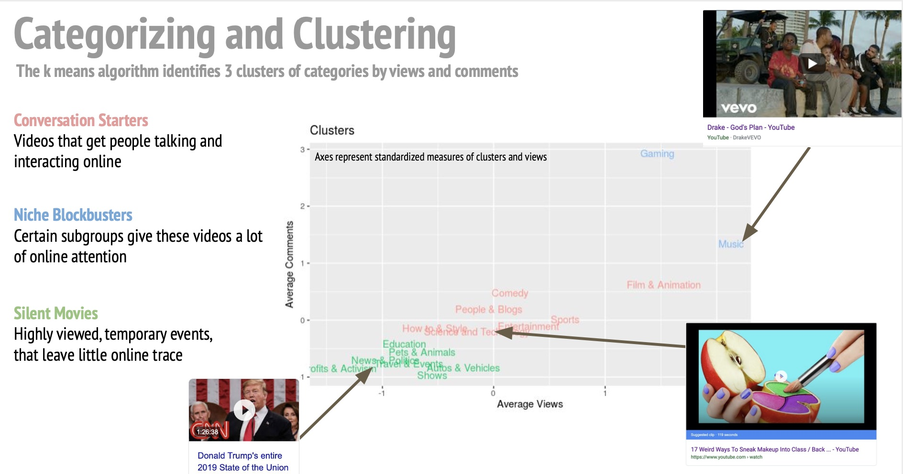

---

## Wharton Analytics Fellows

---


<p><a href = "https://wca.wharton.upenn.edu/students/analytics-fellows/" target = "_blank"> Wharton Analytics Fellows </a>is a fellowship program that unites graduate and undergraduate students across schools at Penn to consult with companies on the development and integration of predictive analytics solutions. Below are sample projects where I served as a Technical Lead. </p>
---

## Psychometrics for Sabermetrics


----

<div class="row">
<div class="col-sm-6">

#### Overview

Looking for any edge above the competitor, professional sports teams have turned to psychometric and biometric data, in addition to traditional on-field metrics, to analyze player performance. We worked with a Major League Baseball team to analyze how players' psychological data, collected by scouting reports, influence projected WAR.

#### Technical
Data cleaning: tidyverse </br>
Text Mining: textmining, tidytext </br>
Topic Modeling: latent dirichlet allocation (LDA) </br>
Clustering: hierarchical clustering (hclust)

</div>
<div class="col-sm-6">


```{r rcourse, out.width=150, echo=F}
knitr::include_graphics("images/mlb.png")
```


</div>
</div>

-----

<div class="row">
<div class="col-sm-6">

#### Sample

Project in Process
</div>
<div class="col-sm-6">

```{r statsTextbook, out.width=150, echo=F}

```


</div>
</div>

-----

## Content Clustering

-----

<div class="row">
<div class="col-sm-6">

#### Overview
Product teams at YouTube analyze previously popular videos to better curate content creation. We build an
unsupervised learning algorithm to identify trends in <a href = "https://www.kaggle.com/datasnaek/youtube-new/" target = "_blank"> a large dataset </a> of YouTube videos. Clustering results inform the sales team on pricing strategies for ads, and guide the product team in content curation.

#### Technical
Data cleaning: tidyverse </br>
Clustering: kmeans

</div>
<div class="col-sm-6">

```{r cogsci, out.width=200, echo=F}
knitr::include_graphics("images/youtube.png")
```

</div>
</div>

-----


<div class="row">
<div class="col-sm-6">

#### Sample


Sample code and charts below. See <a href = "https://github.com/katjanewilson/YouTube" target = "_blank"> GitHub repo </a> for full code and analysis.

</div>
<div class="col-sm-6">


```{r echo=TRUE, message=FALSE, eval=FALSE}
## sample cleaning code
#remove cases with missing video names
usvideos <- usvideos %>%
  filter(video_id != "#NAME?") # removal brings us to 40552 observations
#check for repeat information
df1 <- usvideos%>%
  select(category_id, video_id) %>%
  group_by(video_id, category_id) %>%
  summarise(n = n()) %>%
  arrange(video_id)
length(unique(df1$video_id))
dat <- duplicated(df1[,1])
#graph the data to see outliers
df2<- usvideos %>%
  select(comment_count, likes, dislikes)

#pairs code
pairs(df2)
#boxplot
library(ggplot2)
ggplot(df2, aes(x = "", y=likes)) +
  geom_boxplot(outlier.colour="red", 
             outlier.shape=16,
             outlier.size=2, notch=FALSE)
#residual plots
m1 <- lm(views ~ comment_count + likes + dislikes, data = usvideos)
summary(m1)
plot(fitted(m1), residuals(m1))
abline(h=0)

####COOKS DISTANCE

mod <- lm(views ~ dislikes, data = usvideos)
cooksd <- cooks.distance(mod)
#linear model for Cooks Distance
mod <- lm(views ~ comment_count, data = usvideos)
cooksd <- cooks.distance(mod)
# Plot the Cook's Distance
sample_size <- nrow(usvideos)
# plot(cooksd, pch="*", cex=2, main="Influential Obs by Cooks distance")  # plot cook's distance
# abline(h = 4/sample_size, col="red")  # add cutoff line

#to determine the optimal number of clusters
set.seed(123)
#function to compute total within-cluster sum of square 
wss <- function(k) {
  kmeans(df, k, nstart = 10 )$tot.withinss
}

k.values <- 1:15
# extract wss
wss_values <- map_dbl(k.values, wss)

plot(k.values, wss_values,
     type="b", pch = 19, frame = FALSE, 
     xlab="Number of clusters",
     ylab="Total Sum of Squares")

k2 <- kmeans(df[,(1:3)], centers = 3, nstart = 25)
k2
fviz_cluster(k2, data = df)

df %>%
  as_tibble() %>%
  mutate(cluster = k2$cluster,
         names = row.names(data)) %>%
  ggplot(aes(average_views, average_comments, color = factor(cluster), label = names)) +
  geom_text(alpha = .7) +
  ggtitle("Clusters") +
  ylab("Average Comments" )+
  xlab("Average Views") +
  theme(legend.position = "none")


```


```{r echo=FALSE, out.width= "100%", fig.align = "center",  message=FALSE}
library(tidyverse)
#install.packages("plotly")
library(plotly)
load(file = "data/data1.Rdata")
df <- data %>%
  select(average_comments, average_dislikes,
         average_likes, average_views)

#scale the data
df<- scale(df)
library(factoextra)
distance <- get_dist(df)
plot<- fviz_dist(distance, gradient = list(low = "#00AFBB", mid = "white", high = "#FAD7A0"))
plot

#to determine the optimal number of clusters
set.seed(123)

#function to compute total within-cluster sum of square 
wss <- function(k) {
  kmeans(df, k, nstart = 10 )$tot.withinss
}
k.values <- 1:15

# extract wss
wss_values <- map_dbl(k.values, wss)

plot(k.values, wss_values,
     type="b", pch = 19, frame = FALSE, 
     xlab="Number of clusters",
     ylab="Total Sum of Squares")

k2 <- kmeans(df[,(1:3)], centers = 3, nstart = 25)


```
</a>

</div>
</div>

----------------


