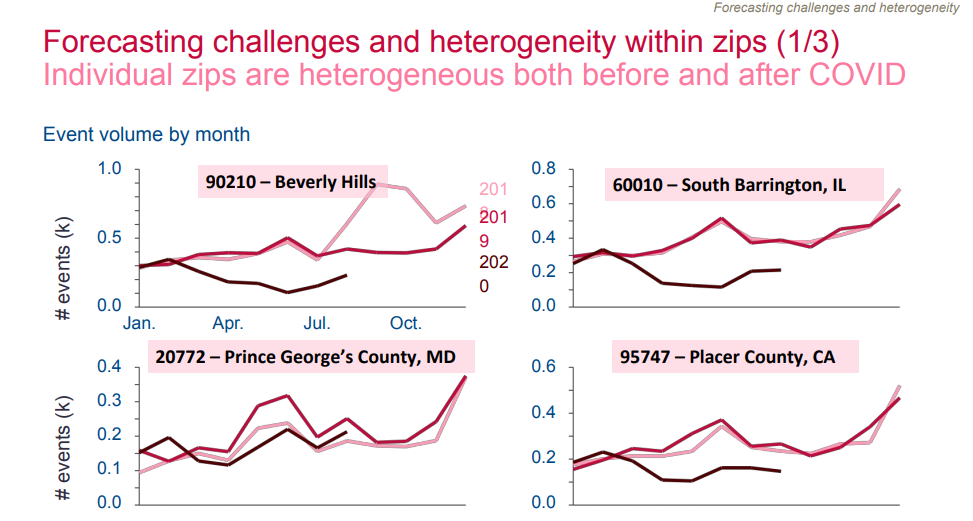
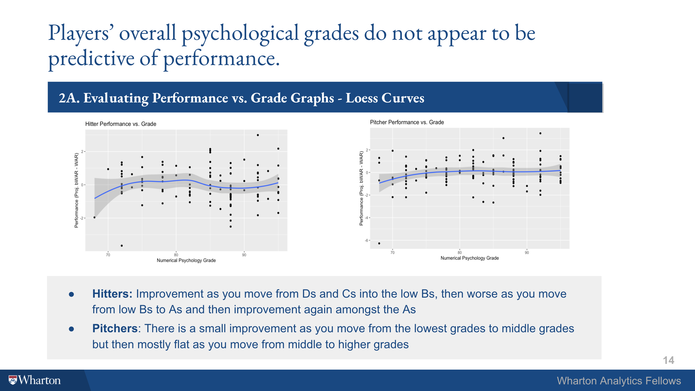

---

<p><a href = "https://wca.wharton.upenn.edu/students/analytics-fellows/" target = "_blank"> Wharton Analytics Fellows </a>is a fellowship program that unites graduate </br> and undergraduate students across schools at Penn to consult with </br>companies on the development and integration  of predictive analytics</br> solutions. Below are sample projects where I served as a Technical Lead. </p>
---


#### Evite

<div class="row">
<div class="col-sm-6">

|Overview |  |
|:--------|-------:|

As a result of the Covid-19 economic and social shutdown in March of 2020, Evite's event business changed. Using Evite's historical event data, and publicly available Covid-19 related data (cases/deaths and city reopening phases), we predict the number of events in particular locations over a three month period, and offer guidance on Evite's business practice during periods of shutdown.

|Technical |  |
|:--------|-------:|
ARIMA Modeling: R (forecast) </br>

  <a href="https://github.com/katjanewilson/BARTsimulation" target = "_blank"><i class="fa fa-github" aria-hidden="true"></i></a>


</div>
<div class="col-sm-6">


```{r, out.width=400, out.height=250, echo=F}

```
</a>

</div>
</div>

---


#### MLB

<div class="row">
<div class="col-sm-6">

|Overview |  |
|:--------|-------:|

Looking for any edge above the competitor, professional sports teams have turned to psychometric and biometric data, in addition to traditional on-field metrics, to analyze player performance. We worked with a Major League Baseball team to analyze how players' psychological data, collected by scouting reports, influence projected WAR.

|Technical |  |
|:--------|-------:|
Text Mining: textmining, tidytext </br>
Topic Modeling: latent dirichlet allocation (LDA) </br>
Clustering: hierarchical clustering (hclust)

  <a href="https://github.com/katjanewilson/BARTsimulation" target = "_blank"><i class="fa fa-github" aria-hidden="true"></i></a>


</div>
<div class="col-sm-6">

<a href="https://katjanewilson.github.io/WhartonAnalytics-MLB//">
```{r, out.width=400, out.height=250, echo=F}

```
</a>

</div>
</div>